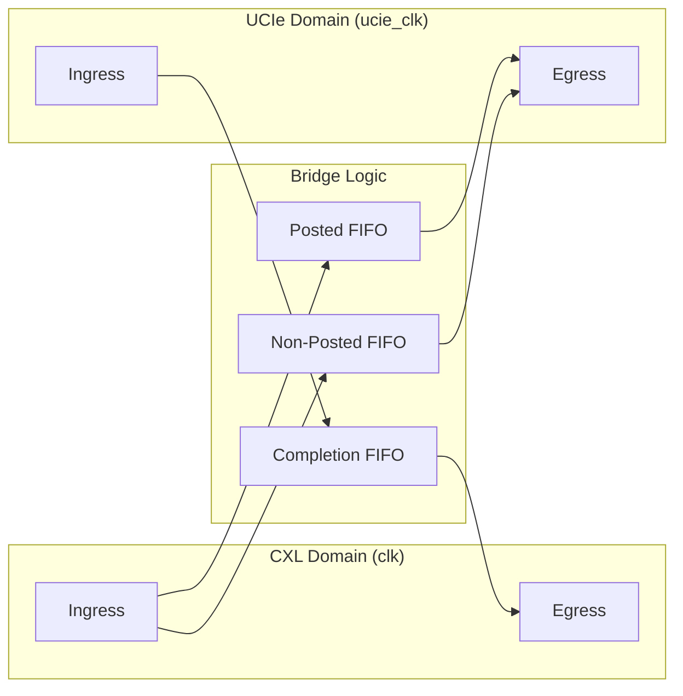

# UCIe to CXL Bridge

[](https://github.com/markrthomas/ucie-cxl-bridge/actions)

Experimental **Verilog / SystemVerilog** RTL for a bridge between **UCIe Adapter Layer** and **CXL (io/cache/mem)**.

## Project Overview

The bridge facilitates communication between die-to-die UCIe interfaces and CXL-based protocol layers. It features a robust **dual-clock asynchronous architecture** (Phase 6 baseline) with cross-domain credit-based flow control.



## Key Features

- **Dual-Clock Domain**: Independent clocking for CXL and UCIe logic.
- **Protocol Translation**: Seamless mapping between CXL.io/mem/cache and UCIe adapter flits.
- **Credit Flow Control**: Hardware-enforced credits per traffic class (Posted, Non-Posted, Completion).
- **Ordering Preservation**: Posted-priority arbitration to maintain spec-compliant ordering.
- **Link State Management**: FSM-controlled power-up and drain sequences.
- **Robust Verification**: 
  - **Directed & Stress**: Concurrent bidirectional traffic with random backpressure.
  - **Formal**: BMC and Cover targets for all critical control logic.
  - **UVM**: Scalable, monitor-driven verification environment.

## Quick Start

### Simulation (Linux/WSL)
```bash
cd verification/directed
make clean && make stress
```

### Formal Verification
```bash
cd verification/formal
sby -f cxl_ucie_bridge.sby
```

### Linting
```bash
cd verification/directed
make lint
```

## Documentation

- **Design Specification**: [doc/design-spec.md](doc/design-spec.md) - Detailed architecture, opcodes, and FSM logic.
- **Verification Plan**: [verification/uvm/README.md](verification/uvm/README.md) - UVM environment and methodology.
- **Contributing**: [CONTRIBUTING.md](CONTRIBUTING.md) - Setup guide and CI details.

## Status: Phase 6 (Baseline)

The current RTL implements granular protocol opcodes and fully integrated cross-domain credit counters. It is verified for structural integrity and logical correctness across varied clock ratios and traffic patterns.

---
*Experimental RTL — for educational and prototyping purposes.*
