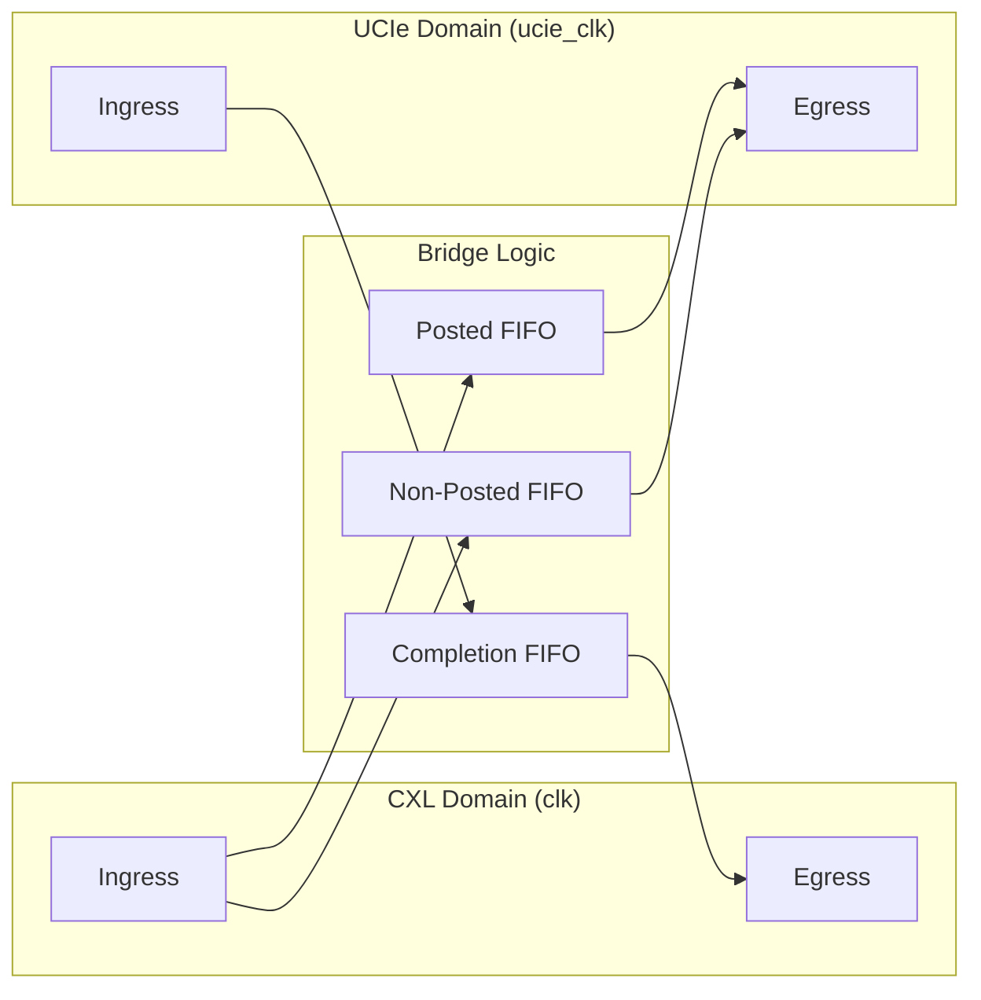

# UCIe to CXL Bridge

[](https://github.com/markrthomas/ucie-cxl-bridge/actions)

Experimental **Verilog / SystemVerilog** RTL for a bridge between **UCIe Adapter Layer** and **CXL (io/cache/mem)**.

## Project Overview

The bridge facilitates communication between die-to-die UCIe interfaces and CXL-based protocol layers. It features a robust **dual-clock asynchronous architecture** (Phase 6 baseline) with cross-domain credit-based flow control.



## Key Features

- **Dual-Clock Domain**: Independent clocking for CXL and UCIe logic.
- **Protocol Translation**: Seamless mapping between CXL.io/mem/cache and UCIe adapter flits.
- **Credit Flow Control**: Hardware-enforced credits per traffic class (Posted, Non-Posted, Completion).
- **Ordering Preservation**: Posted-priority arbitration to maintain spec-compliant ordering.
- **Link State Management**: FSM-controlled power-up and drain sequences.
- **Robust Verification**: 
  - **Directed & Stress**: Concurrent bidirectional traffic with random backpressure.
  - **Formal**: BMC and Cover targets for all critical control logic.
  - **UVM**: Starter monitor-driven environment for constrained-random expansion.

## Current Architecture

| Path | Source Domain | Destination Domain | Buffer | Flow Control |
|:---|:---|:---|:---|:---|
| CXL posted request | `clk` | `ucie_clk` | `u_c2u_posted` async FIFO | `POSTED_CREDITS` |
| CXL non-posted request | `clk` | `ucie_clk` | `u_c2u_np` async FIFO | `NP_CREDITS` |
| UCIe completion | `ucie_clk` | `clk` | `u_u2c` async FIFO | `CPL_CREDITS` |

The top-level packet model is a fixed 64-bit simulation format:

| Bits | Field | Use |
|:---|:---|:---|
| `[63:60]` | Kind | CXL packet kind or UCIe adapter packet kind. |
| `[59:56]` | Code | Opcode, message type, or completion status. |
| `[55:48]` | Tag / transaction ID | Correlates requests and completions. |
| `[47:32]` | Address / byte count | Address slice on requests, byte count on completions. |
| `[31:24]` | Length | Length in DW units in the model. |
| `[23:16]` | Requester / source / completer ID | Endpoint identifier. |
| `[15:8]` | Attributes / lower address | Sideband request attributes or completion lower address. |
| `[7:0]` | Misc / checksum | CRC-8 checksum on UCIe-facing packets. |

## Module Map

| Module | Role |
|:---|:---|
| `src/cxl_ucie_bridge.v` | Top-level translation, arbitration, credit, and link-gating integration. |
| `src/cxl_ucie_bridge_defs.vh` | Packet constants, pack helpers, and CRC-8 checksum function. |
| `src/async_fifo.v` | Dual-clock first-word-fall-through FIFO with Gray-coded pointer CDC. |
| `src/credit_counter.v` | Saturating credit availability counter. |
| `src/credit_pulse_sync.v` | Toggle-based pulse crossing for credit returns. |
| `src/reset_drain.v` | DOWN / UP / DRAIN link-state gate. |
| `src/cxl_ucie_bridge_chk.v` | Simulation checker wrapper used by directed tests. |

## Quick Start

### Simulation (Linux/WSL)
```bash
cd verification/directed
make clean && make stress
```

### Formal Verification
```bash
cd verification/formal
sby -f cxl_ucie_bridge.sby
```

### Linting
```bash
cd verification/directed
make lint
```

## Documentation

- **Design Specification**: [doc/design-spec.md](doc/design-spec.md) - Detailed architecture, opcodes, and FSM logic.
- **Verification Plan**: [verification/uvm/README.md](verification/uvm/README.md) - UVM environment and methodology.
- **Contributing**: [CONTRIBUTING.md](CONTRIBUTING.md) - Setup guide and CI details.

## Status: Phase 6 (Baseline)

The current RTL implements granular protocol opcodes and fully integrated cross-domain credit counters. It is verified for structural integrity and logical correctness across varied clock ratios and traffic patterns.

## Known Limits

| Area | Current Limit |
|:---|:---|
| Protocol compliance | The 64-bit packet format is a compact model, not a full CXL or UCIe wire encoding. |
| Payload data | Header/control fields are modeled; multi-beat payload transport is not implemented. |
| Link training | `link_up` is an external input consumed by the reset-drain FSM; PHY training is out of scope. |
| UVM | UVM files provide a starter constrained-random environment; directed tests remain the executable regression baseline. |

---
*Experimental RTL — for educational and prototyping purposes.*
