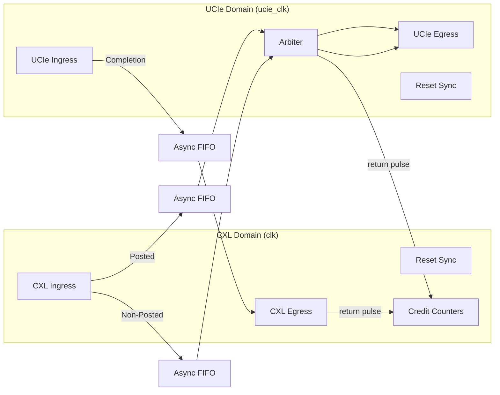
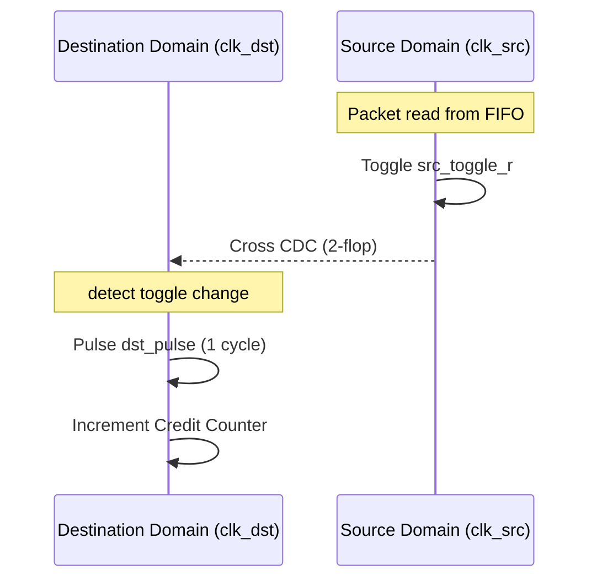
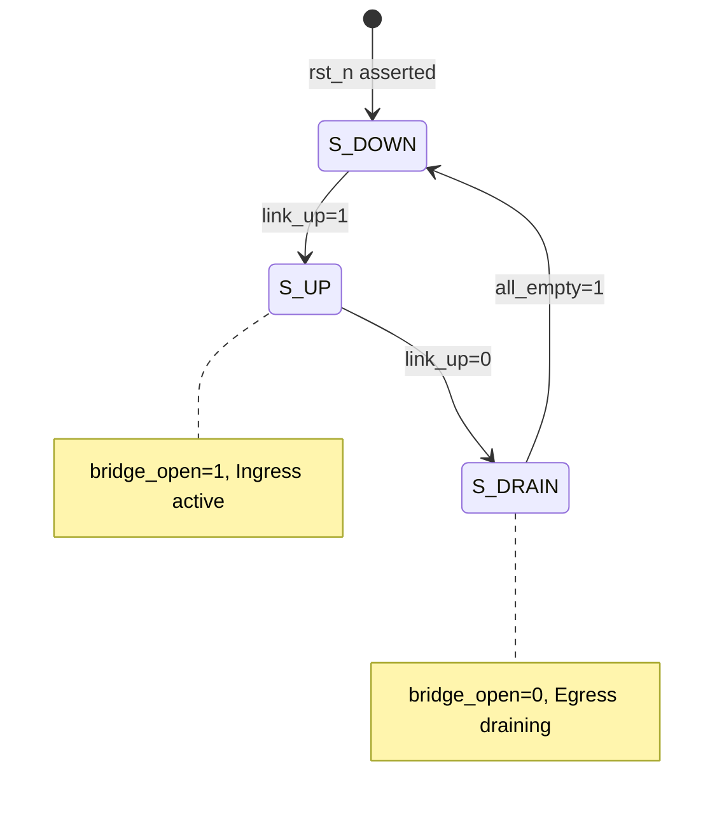

# 1. Purpose and scope

This document specifies the design intent for an experimental **bridge between Compute Express Link (CXL)** traffic and a **UCIe-compatible adapter-layer interface**. The implementation targets **Verilog** suitable for simulation with **Icarus Verilog** (`iverilog` / `vvp`).

**In scope today:** simulation bring-up, a documented module boundary, a typed packet taxonomy covering CXL.io / CXL.mem / CXL.cache and matching UCIe adapter completions, a dual-clock asynchronous architecture with robust credit-based flow control, and a link bring-up model.

**Out of scope for the current RTL:** full CXL protocol compliance, production UCIe PHY and link training, payload movement, retries, and full link bring-up sequencing.

# 2. Background

CXL defines memory, cache-coherent, and I/O semantics over a PCIe physical layer. UCIe defines die-to-die interconnect including adapter layers that carry protocol flits. A bridge must translate semantic and transport assumptions between these domains while preserving **ordering** where required and honoring **flow control** on both sides.

# 3. Goals

The bridge is intended to support:

1. **Protocol translation** — Map CXL.io, CXL.cache, and CXL.mem concepts to and from UCIe adapter-layer traffic.
2. **Asynchronous Operation** — Support independent clock domains for CXL and UCIe logic.
3. **Credit-based flow control** — Reflect credits available from each side so the bridge does not overrun peer buffers.
4. **Ordering preservation** — Maintain required ordering classes (Posted vs. Non-Posted) between ingress and egress.
5. **Link bring-up model** — Model reset, training handshakes, and readiness gates relevant to safe traffic acceptance.

# 4. Architecture

The bridge provides a low-latency, credit-flow-controlled translation layer between a CXL-facing domain and a UCIe-facing domain.

## 4.1 Target architecture (summary)

At a high level, the bridge sits between:
- A **CXL-facing port** (logical aggregation of CXL.io / CXL.cache / CXL.mem).
- A **UCIe-facing port** (adapter-layer ingress and egress).

## 4.2 Current implementation (Phase 6 baseline)

The repository contains a **Phase 6 RTL** featuring a **dual-clock asynchronous architecture**, robust **reset synchronization**, and **granular protocol support**.

### 4.2.1 Protocol Translation

The bridge performs combinational field remapping on ingress. The mapping for CXL to UCIe is summarized below:

| CXL Kind | CXL Opcode | UCIe Message Type | Ordering Class |
|:---|:---|:---|:---|
| `CXL_IO_REQ` | Any | `UCIE_MSG_CFG` | Non-Posted |
| `CXL_MEM_RD` | `RD` | `UCIE_MSG_MEM_RD` | Non-Posted |
| `CXL_MEM_RD` | `RD_DATA` | `UCIE_MSG_MEM_RD_DATA` | Non-Posted |
| `CXL_MEM_WR` | `WR` | `UCIE_MSG_MEM_WR` | Posted |
| `CXL_MEM_WR` | `WR_DATA` | `UCIE_MSG_MEM_WR_DATA` | Posted |
| `CXL_CACHE_RD` | `RD` | `UCIE_MSG_CACHE_RD` | Non-Posted |
| `CXL_CACHE_RD` | `RD_DATA` | `UCIE_MSG_CACHE_RD_DATA` | Non-Posted |
| `CXL_CACHE_WR` | `WR` | `UCIE_MSG_CACHE_WR` | Posted |
| `CXL_CACHE_WR` | `WR_DATA` | `UCIE_MSG_CACHE_WR_DATA` | Posted |

### 4.2.2 Flow Control (Credits)

Flow control is managed via a **toggle-based credit return mechanism** that safely crosses clock domains without pulse loss. Credits are consumed on FIFO write and returned on FIFO read from the peer domain.

### 4.2.3 Asynchronous Buffering

Three independent **Asynchronous FIFOs** (`src/async_fifo.v`) handle cross-domain buffering:
- `u_c2u_posted`: CXL Domain Ingress -> UCIe Domain Egress (Posted)
- `u_c2u_np`: CXL Domain Ingress -> UCIe Domain Egress (Non-Posted)
- `u_u2c`: UCIe Domain Ingress -> CXL Domain Egress (Completions)

# 5. Interface summary

## 5.1 Common & Control

| Signal | Dir | Domain | Description |
|:---|:---|:---|:---|
| `clk` | In | N/A | CXL domain core clock. |
| `ucie_clk` | In | N/A | UCIe domain core clock. |
| `rst_n` | In | Async | Global asynchronous reset (active low). |
| `link_up` | In | clk | Link status; initiates FSM transitions. |
| `err_inj_en` | In | clk | Enables CRC error injection on next C2U flit. |
| `drain_done` | Out | clk | Asserted when link is DOWN and all buffers are empty. |

## 5.2 CXL Port (CXL Domain)

| Signal | Dir | Description |
|:---|:---|:---|
| `cxl_in_valid` | In | Valid for ingress CXL flit. |
| `cxl_in_ready` | Out | Ready for ingress CXL flit (gated by credits and FIFO space). |
| `cxl_in_data` | In | 64-bit CXL flit data. |
| `cxl_out_valid` | Out | Valid for egress CXL flit (completions). |
| `cxl_out_ready` | In | Ready for egress CXL flit. |
| `cxl_out_data` | Out | 64-bit CXL flit data. |

## 5.3 UCIe Port (UCIe Domain)

| Signal | Dir | Description |
|:---|:---|:---|
| `ucie_in_valid` | In | Valid for ingress UCIe flit. |
| `ucie_in_ready` | Out | Ready for ingress UCIe flit (gated by credits and FIFO space). |
| `ucie_in_data` | In | 64-bit UCIe flit data. |
| `ucie_out_valid` | Out | Valid for egress UCIe flit (requests). |
| `ucie_out_ready` | In | Ready for egress UCIe flit. |
| `ucie_out_data` | Out | 64-bit UCIe flit data. |

# 6. Bring-up and non-ideal behavior

## 6.1 Reset-drain FSM

The `reset_drain` module manages link state transitions.

| State | Bridge Status | Behavior |
|:---|:---|:---|
| `S_DOWN` | Closed | Ingress `ready` is deasserted. Logic is idle. |
| `S_UP` | Open | Normal operation; ingress and egress active. |
| `S_DRAIN` | Closed | Ingress `ready` is deasserted. Egress continues to drain existing FIFO contents. |

# 7. Verification

## 7.1 Directed & Stress Tests
- **Simulator:** Icarus Verilog.
- **Suite:** `tb_cxl_ucie_bridge.v` covers every packet kind, ordering rules, link gating, and heavy concurrent stress.

## 7.2 Formal Verification
- **Tool:** SymbiYosys (`sby`).
- **Scope:**
    - `sync_fifo.sby`: FIFO safety (no overflow/underflow).
    - `reset_drain.sby`: FSM transition validity.
    - `cxl_ucie_bridge.sby`: End-to-end invariants, credit availability, and protocol mapping correctness.

## 7.3 UVM Environment
- **Location:** `verification/uvm/`.
- **Status:** Structurally complete for Phase 6. Features independent CXL and UCIe agents with monitors and a cross-domain scoreboard.

# 8. Roadmap (phased milestones)

1. **Narrow first target (done ✓)** — Typed 64-bit packet definitions, synchronous FIFO.
2. **Broaden typed traffic (done ✓)** — Full CXL.io / CXL.mem / CXL.cache packet taxonomy.
3. **Flow control and ordering (done ✓)** — Posted/non-posted ordering domain split.
4. **Bring-up and non-ideal behavior (done ✓)** — `reset_drain` link-state FSM.
5. **Dual-clock asynchronous architecture (done ✓)** — Separated `clk` and `ucie_clk` domains.
6. **Advanced Protocol & Flow Control (done ✓)** — Granular opcodes, integrated cross-domain credit counters.

# 9. Repository layout

| Path | Role |
|------|------|
| `src/async_fifo.v` | Dual-clock asynchronous FIFO. |
| `src/credit_counter.v` | Parameterized credit tracker. |
| `src/credit_pulse_sync.v` | Toggle-based credit pulse synchronizer. |
| `src/reset_sync.v` | Asynchronous assert, synchronous deassert reset handler. |
| `src/cxl_ucie_bridge.v` | Top-level bridge RTL. |
| `verification/` | Directed, Formal, and UVM environments. |
| `doc/` | Design specification and documentation. |
