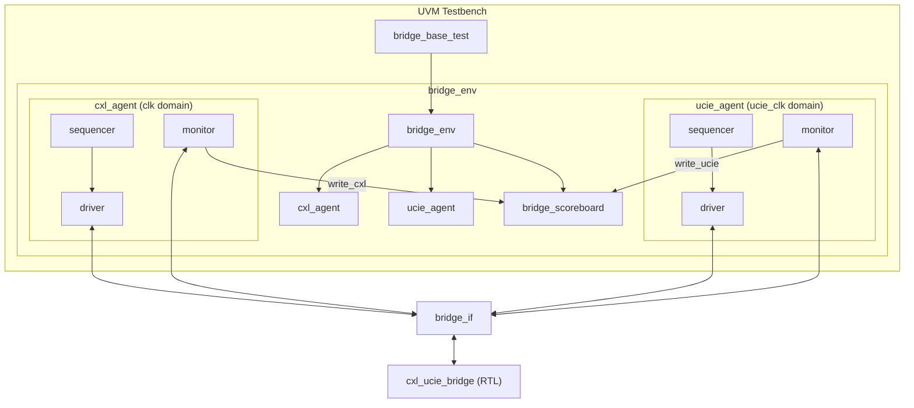

# UVM Verification Environment

This directory contains a **Universal Verification Methodology (UVM 1.2)** environment for the CXL-UCIe bridge. It provides a scalable, constrained-random alternative to the primary directed testbench, specifically designed for high-coverage closure.

## Architecture

The environment is built to handle the asynchronous, multi-domain nature of the bridge.



## Key Components

### 1. Scoreboard (`bridge_scoreboard`)
The scoreboard performs end-to-end data integrity checks across the clock boundary.
- **Predictor**: Models the combinational translation and CRC calculation logic.
- **Checker**: Matches egress transactions against predicted items stored in class-specific queues (`c2u_exp_q`, `u2c_exp_q`).
- **Flow Control**: Monitors credit exhaustion and ensures the DUT never overruns internal or peer buffers.

### 2. Monitor-Driven Agents
Each agent is fully autonomous within its clock domain:
- **CXL Agent**: Operates on `clk`. Observes ingress flits and validates they are correctly routed based on ordering class.
- **UCIe Agent**: Operates on `ucie_clk`. Monitors adapter flits and verifies checksums.

### 3. Virtual Interface (`bridge_if`)
The interface features independent **Clocking Blocks** for each domain, ensuring race-free signal driving and sampling.

```systemverilog
  clocking cxl_cb @(posedge clk);
    output cxl_in_valid, cxl_in_data;
    input  cxl_in_ready;
    input  cxl_out_valid, cxl_out_data;
    output cxl_out_ready;
  endclocking

  clocking ucie_cb @(posedge ucie_clk);
    output ucie_in_valid, ucie_in_data;
    input  ucie_in_ready;
    input  ucie_out_valid, ucie_out_data;
    output ucie_out_ready;
  endclocking
```

## Transaction Model (`bridge_item`)

The `bridge_item` represents a single 64-bit beat with metadata for constrained-random stimulus.

| Property | Type | Description |
|:---|:---|:---|
| `data` | `bit [63:0]` | Raw flit payload. |
| `kind` | `enum` | CXL packet kind (IO, MEM, CACHE, etc.). |
| `delay` | `int` | Random inter-transaction stall cycles. |

## Sequence Library

- **`bridge_base_seq`**: Basic 10-item randomized sequence.
- **`bridge_stress_seq`**: Concurrent bidirectional traffic with maximum backpressure (planned).
- **`bridge_credit_seq`**: Targeted stimulus to hit credit-exhaustion edge cases (planned).

## Getting Started

### Requirements
- **Simulator**: Synopsys VCS (recommended) or any UVM-compliant tool.
- **UVM Version**: 1.2.

### Execution (VCS Example)
```bash
vcs -sverilog -ntb_opts uvm-1.2 \
    +incdir+../../../src \
    +incdir+./tb \
    +incdir+./agents/cxl_agent \
    +incdir+./agents/ucie_agent \
    +incdir+./env \
    +incdir+./seq \
    +incdir+./tests \
    ../../../src/cxl_ucie_bridge.v \
    ./tb/bridge_pkg.sv \
    ./tb/top.sv \
    -o simv

./simv +UVM_TESTNAME=bridge_base_test
```
