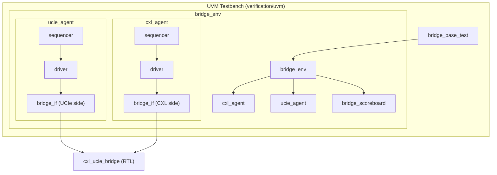

# UVM Testbench for CXL-UCIe Bridge

This directory contains a UVM-based verification environment for the CXL-UCIe bridge, designed for use with Synopsys VCS. It provides a scalable, constrained-random alternative to the primary directed testbench.

## Architecture Overview

The environment follows a standard UVM architecture, isolating the Design Under Test (DUT) from stimulus generation and checking logic.



## Directory Structure

| Path | Responsibility |
|:---|:---|
| `tb/top.sv` | SystemVerilog top; clock/reset generation; interface instantiation. |
| `tb/bridge_if.sv` | Virtual interface with clocking blocks for CXL and UCIe domains. |
| `tb/bridge_pkg.sv` | Global package importing UVM and local components. |
| `agents/cxl_agent/` | CXL-side driver, sequencer, and agent logic. |
| `agents/ucie_agent/` | UCIe-side driver, sequencer, and agent logic. |
| `env/` | Orchestration layer (environment and scoreboard). |
| `seq/` | Reusable sequence library for protocol-specific stimulus. |
| `tests/` | Test library defining specific test scenarios and configurations. |

## Verification Components

### 1. Agents and Drivers
The testbench uses two independent agents to drive the CXL and UCIe interfaces.
- **CXL Driver**: Handles the `cxl_in_*` and `cxl_out_*` signals. It interprets `bridge_item` transactions and converts them to valid/ready handshakes.
- **UCIe Driver**: Manages the `ucie_in_*` and `ucie_out_*` signals, simulating the behavior of a UCIe adapter layer.

### 2. Scoreboard and Checking
The `bridge_scoreboard` is responsible for end-to-end data integrity. It maintains an internal model of the bridge's translation logic:
- **CXL -> UCIe**: Maps CXL request kinds to `UCIE_PKT_KIND_AD_REQ` and calculates the expected CRC-8/CCITT checksum.
- **UCIe -> CXL**: Verifies incoming UCIe checksums and maps completions back to CXL kinds.

### 3. Transaction Model (`bridge_item`)
The `bridge_item` represents a single 64-bit packet beat.

| Field | Bits | Description |
|:---|:---|:---|
| `data` | [63:0] | Raw 64-bit flit payload. |
| `delay` | N/A | Inter-transaction delay (constrained-random). |

## Requirements

- **Simulator**: Synopsys VCS
- **Methodology**: UVM 1.2
- **Documentation Build**: `pandoc` + `pdflatex` (for PDF generation)

## Running with VCS

To compile and run the testbench:

```bash
vcs -sverilog -ntb_opts uvm-1.2 \
    +incdir+../../../src \
    +incdir+./tb \
    +incdir+./agents/cxl_agent \
    +incdir+./agents/ucie_agent \
    +incdir+./env \
    +incdir+./seq \
    +incdir+./tests \
    ../../../src/cxl_ucie_bridge.v \
    ./tb/bridge_pkg.sv \
    ./tb/top.sv \
    -o simv

./simv +UVM_TESTNAME=bridge_base_test
```

## Documentation

To generate a PDF version of this documentation:

```bash
make pdf
```
