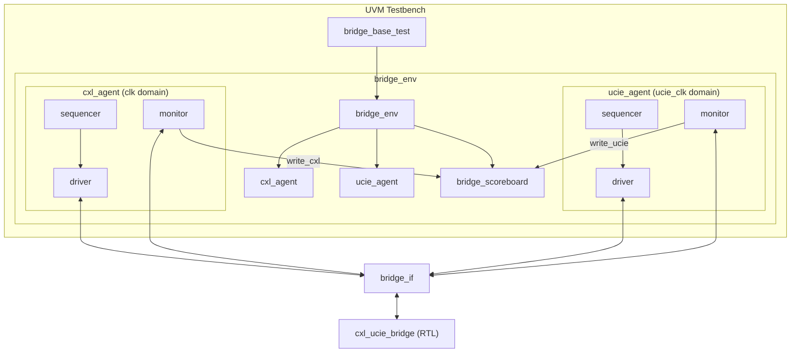

# UVM Verification Environment

This directory contains a **Universal Verification Methodology (UVM 1.2)** scaffold for the CXL-UCIe bridge. It is intended to grow into a constrained-random environment while the directed testbench remains the primary executable regression.

## Architecture

The environment is built to handle the asynchronous, multi-domain nature of the bridge.


```mermaid
graph TD
    subgraph "UVM Testbench"
        Test["bridge_base_test"] --> Env["bridge_env"]
        subgraph "bridge_env"
            Env --> CXL_Agent["cxl_agent"]
            Env --> UCIE_Agent["ucie_agent"]
            Env --> SB["bridge_scoreboard"]
            
            subgraph "cxl_agent (clk domain)"
                CXL_SQ["sequencer"] --> CXL_DRV["driver"]
                CXL_MON["monitor"]
            end
            
            subgraph "ucie_agent (ucie_clk domain)"
                UCIE_SQ["sequencer"] --> UCIE_DRV["driver"]
                UCIE_MON["monitor"]
            end
        end
    end
    
    CXL_DRV & CXL_MON <--> VIF["bridge_if"]
    UCIE_DRV & UCIE_MON <--> VIF
    VIF <--> DUT["cxl_ucie_bridge (RTL)"]

    CXL_MON -- write_cxl --> SB
    UCIE_MON -- write_ucie --> SB
```

## Key Components

### 1. Scoreboard (`bridge_scoreboard`)
The scoreboard performs protocol-accurate, end-to-end checks across the clock boundary.
- **Prediction**: `env/bridge_predict.sv` mirrors the RTL translation, CRC-8 checksum, and payload-length logic (a package-local copy of `cxl_ucie_bridge_defs.vh` — the DUT's include guard would otherwise skip the header inside the package). Each accepted CXL request predicts its UCIe egress flit and vice-versa.
- **Ordering**: C2U predictions are held in per-class (posted / non-posted) queues and matched by the class of the emerging flit, so the reordering egress arbiter is handled correctly. U2C is a single in-order queue.
- **Payload (Phase 7)**: header/payload beats are classified by mirror counters that decode the same length fields as the RTL; write payload beats are content-checked in order per class.
- **Verdict**: `check_phase` flags any unmatched prediction/payload left at end of test; `report_phase` prints checked counts and PASS/FAIL.
- **Flow-control goal**: add credit-exhaustion and no-overrun checks (Phase 9).

### 2. Monitor-Driven Agents
Each agent is fully autonomous within its clock domain:
- **CXL Agent**: Operates on `clk`. Observes ingress flits and validates they are correctly routed based on ordering class.
- **UCIe Agent**: Operates on `ucie_clk`. Monitors adapter flits and verifies checksums.

### 3. Virtual Interface (`bridge_if`)
The interface features independent **Clocking Blocks** for each domain, ensuring race-free signal driving and sampling.

```systemverilog
  clocking cxl_cb @(posedge clk);
    output cxl_in_valid, cxl_in_data;
    input  cxl_in_ready;
    input  cxl_out_valid, cxl_out_data;
    output cxl_out_ready;
  endclocking

  clocking ucie_cb @(posedge ucie_clk);
    output ucie_in_valid, ucie_in_data;
    input  ucie_in_ready;
    input  ucie_out_valid, ucie_out_data;
    output ucie_out_ready;
  endclocking
```

## Transaction Model (`bridge_item`)

The `bridge_item` represents a single 64-bit beat with metadata for constrained-random stimulus.

| Property | Type | Description |
|:---|:---|:---|
| `data` | `bit [63:0]` | Raw flit payload. |
| `kind` | `enum` | CXL packet kind (IO, MEM, CACHE, etc.). |
| `delay` | `int` | Random inter-transaction stall cycles. |

## Sequence Library

- **`bridge_base_seq`**: Basic 10-item randomized sequence.
- **`bridge_stress_seq`**: Concurrent bidirectional traffic with maximum backpressure (planned).
- **`bridge_credit_seq`**: Targeted stimulus to hit credit-exhaustion edge cases (planned).

## Implementation Status

| Component | Status | Notes |
|:---|:---|:---|
| `bridge_if` | Implemented | Provides independent clocking blocks for CXL, UCIe, and monitor sampling. |
| CXL agent | Implemented scaffold | Includes sequencer, driver, and monitor. |
| UCIe agent | Implemented scaffold | Includes sequencer, driver, and monitor. |
| Base sequence | Implemented | `bridge_base_seq` (random beats) + `bridge_cxl_seq` / `bridge_ucie_seq` (constrained-random *legal* requests/completions; writes and SC completions expand into header + payload beats). |
| Scoreboard | Implemented | Translation-, ordering-, and payload-accurate prediction + PASS/FAIL verdict (`bridge_scoreboard` + `bridge_predict`). |
| Functional coverage | Implemented | Covergroups in the scoreboard: C2U kind × payload-length cross, U2C kind × status cross (sampled on ingress headers). |
| Base test | Implemented | Runs both sequences concurrently, then drains before the scoreboard verdict. |
| Credit / backpressure sequences | Planned (Phase 9 / 8) | Targeted credit-exhaustion and randomized-backpressure stimulus. |

> **Run status:** the environment targets UVM 1.2 on a commercial simulator (VCS/Questa); it is **not runnable with the OSS toolchain** here (Icarus/Verilator lack full UVM 1.2). The `verification/cocotb` suite is the OSS-runnable equivalent. The scoreboard prediction file (`bridge_predict.sv`) is Verilator-lint-clean; the UVM classes are reviewed but need a UVM simulator to execute. A clean end-to-end PASS also needs Phase 8 stimulus (well-formed sequences + an end-of-test drain); the base sequence drives random beats and may leave in-flight packets unmatched at `#1000`.

## Relationship to Directed Tests

| Environment | Best Use Today |
|:---|:---|
| `verification/directed` | Compile/lint/smoke/stress regression with Icarus Verilog and Verilator lint. |
| `verification/formal` | Bounded proofs and cover targets for FIFO, reset-drain, and bridge invariants. |
| `verification/uvm` | Starting point for commercial-simulator constrained-random development. |

## Getting Started

### Requirements
- **Simulator**: Synopsys VCS (recommended) or any UVM-compliant tool.
- **UVM Version**: 1.2.

### Execution (VCS Example)
```bash
vcs -sverilog -ntb_opts uvm-1.2 \
    +incdir+../../../src \
    +incdir+./tb \
    +incdir+./agents/cxl_agent \
    +incdir+./agents/ucie_agent \
    +incdir+./env \
    +incdir+./seq \
    +incdir+./tests \
    ../../../src/cxl_ucie_bridge.v \
    ./tb/bridge_pkg.sv \
    ./tb/top.sv \
    -o simv

./simv +UVM_TESTNAME=bridge_base_test
```
